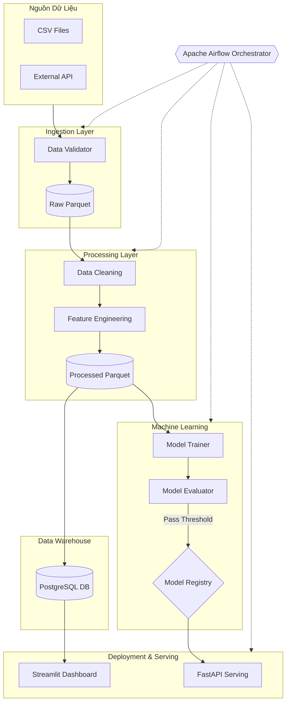

# SkilioPay Customer Churn Prediction Pipeline


## 1. Giới Thiệu Dự Án

**SkilioPay Churn Prediction Pipeline** là một hệ thống kỹ thuật dữ liệu (Data Engineering) toàn diện, được thiết kế để tự động hóa quy trình dự đoán khả năng rời bỏ dịch vụ (churn) của khách hàng.

Hệ thống tích hợp quy trình ETL (Extract, Transform, Load), huấn luyện mô hình Machine Learning (Auto-training), và triển khai API dự đoán thời gian thực. Toàn bộ quy trình được điều phối tự động bởi **Apache Airflow** chạy trên môi trường **Docker**.

### Mục tiêu chính
*   **Tự động hóa**: Loại bỏ các thao tác thủ công trong việc xử lý dữ liệu và huấn luyện mô hình.
*   **Khả năng mở rộng**: Kiến trúc module hóa, dễ dàng mở rộng thêm các nguồn dữ liệu mới.
*   **Giám sát trực quan**: Cung cấp Dashboard theo dõi hiệu suất mô hình và chất lượng dữ liệu.

---

## 2. Kiến Trúc Hệ Thống

Hệ thống được thiết kế theo kiến trúc Modular Monolith, với các component được tách biệt rõ ràng đảm bảo tính bảo trì và mở rộng.



### Luồng xử lý dữ liệu (Data Flow)
1.  **Ingestion**: Dữ liệu từ CSV/API được thu thập, kiểm tra schema (Validation) và lưu dưới dạng Raw Parquet.
2.  **Processing**: Làm sạch dữ liệu, xử lý missing values, và tạo các đặc trưng (Feature Engineering).
3.  **Storage**: Dữ liệu sạch và Feature được lưu vào PostgreSQL Data Warehouse để phục vụ phân tích.
4.  **Training**: Mô hình XGBoost được huấn luyện tự động trên dữ liệu mới nhất.
5.  **Evaluation**: Mô hình được đánh giá (Accuracy, ROC-AUC). Chỉ những mô hình đạt ngưỡng mới được deploy.
6.  **Serving**: API cung cấp endpoint dự đoán realtime.
7.  **Monitoring**: Dashboard hiển thị KPIs, Data Quality và Model Performance.

---

## 3. Công Nghệ Sử Dụng

| Lĩnh vực | Công nghệ | Mục đích |
| :--- | :--- | :--- |
| **Orchestration** | Apache Airflow | Lên lịch và điều phối luồng công việc (DAGs) |
| **Containerization** | Docker & Docker Compose | Đóng gói môi trường, đảm bảo tính nhất quán |
| **Database** | PostgreSQL | Data Warehouse lưu trữ thông tin khách hàng và features |
| **Data Processing** | Pandas, Numpy | Xử lý, biến đổi dữ liệu dữ liệu dạng bảng |
| **Machine Learning** | XGBoost, Scikit-learn | Huấn luyện mô hình phân loại (Classification) |
| **API Framework** | FastAPI | Cung cấp REST API cho việc dự đoán |
| **Dashboard** | Streamlit | Giao diện trực quan hóa dữ liệu và giám sát hệ thống |
| **Validation** | Cerberus, Pydantic | Kiểm tra chất lượng dữ liệu đầu vào |

---

## 4. Đặc Điểm Nổi Bật

*   **Kiểm Soát Chất Lượng Dữ Liệu (Data Quality)**: Tích hợp module validation chặt chẽ, tự động loại bỏ bản ghi lỗi và cảnh báo khi dữ liệu vi phạm schema.
*   **CI/CD cho Model**: Pipeline tự động đánh giá mô hình sau khi huấn luyện. Nếu hiệu suất giảm, model mới sẽ không được deploy, đảm bảo độ ổn định.
*   **Dockerized Environment**: Toàn bộ hệ thống (Airflow, Postgres, Redis, Worker) được đóng gói trong Docker Compose, triển khai chỉ với 1 lệnh.
*   **Real-time Dashboard**: Theo dõi sức khỏe hệ thống và phân tích hành vi khách hàng tức thì.

---

## 5. Dashboard Monitor

Giao diện Dashboard giúp Stakeholders và Kỹ sư dữ liệu nắm bắt tình hình hệ thống.

**Tổng Quan (Overview UI)**


**Phân Tích Chi Tiết (Analytics)**


---

## 6. Hướng Dẫn Cài Đặt & Vận Hành

### Yêu cầu tiên quyết
*   Docker & Docker Compose (Desktop installed on Windows/Mac/Linux)
*   Git

### Bước 1: Clone dự án
```bash
git clone https://github.com/your-repo/skilio-pay-pipeline.git
cd skilio-pay-pipeline
```

### Bước 2: Khởi tạo hệ thống (Chạy lần đầu)
Sử dụng script tự động để build images và khởi tạo database Airflow.

```powershell
# Windows
.\scripts\init_airflow.bat
```

### Bước 3: Khởi động Pipeline
Bật toàn bộ services (Airflow Webserver, Scheduler, Postgres, Triggerer).

```powershell
# Windows
.\scripts\start_airflow.bat
```

Sau khi khởi động:
*   **Airflow UI**: [http://localhost:8080](http://localhost:8080) (Tài khoản: `airflow` / `airflow`)
*   **Pipeline Dashboard**: [http://localhost:8501](http://localhost:8501)

### Bước 4: Chạy DAG
1.  Truy cập Airflow UI.
2.  Tìm DAG `skilio_pay_churn_prediction_pipeline`.
3.  Bật switch **ON** và nhấn nút **Trigger DAG** (nút Play).

---

## 7. Cấu Trúc Dự Án

```
├── config/               # Cấu hình hệ thống (YAML, JSON Schemas)
├── dags/                 # Airflow DAGs definition
├── data/                 # Thư mục chứa dữ liệu (Raw, Processed) - được mount vào Docker
├── docker/               # Dockerfile tùy chỉnh
├── logs/                 # Logs hệ thống
├── scripts/              # Scripts tiện ích (Init, Start, Stop)
├── src/                  # Mã nguồn chính
│   ├── ingestion/        # Modules thu thập dữ liệu
│   ├── processing/       # Modules xử lý & ETL
│   ├── storage/          # Tương tác Database
│   ├── ml/               # Huấn luyện & đánh giá Model
│   ├── serving/          # API Serving
│   ├── dashboard/        # Streamlit App
│   └── utils/            # Tiện ích chung (Logger, Config loader)
├── tests/                # Unit tests
├── docker-compose.yml    # Định nghĩa services
└── README.md             # Tài liệu dự án
```

---

**Liên hệ**: [Your Name/Email]
